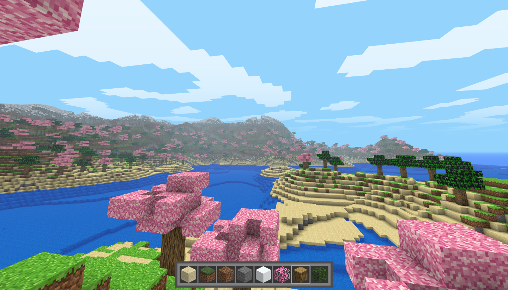

# Voxel Engine Project

A small, experimental voxel engine built with Python, ModernGL, PyGame, and PyGLM. The engine renders a 3D block world, complete with water, clouds, and a player-driven camera. It also demonstrates how to render a simple 2D GUI overlay (like a hotbar) on top of the 3D scene.



## Table of Contents
1. [Overview](#overview)  
2. [Features](#features)  
3. [Project Structure](#project-structure)  
4. [Installation](#installation)  
5. [Usage](#usage)  
6. [To-Do](#to-do)

---

## Overview

- **3D Voxel World**: The project draws cube-based terrain (sand, grass, dirt, stone, etc.) in a procedurally generated environment.  
- **2D GUI Hotbar**: A simple 2D overlay is rendered after the main 3D pass.  
- **Player Camera**: A first-person camera with mouse-look and keyboard movement.  
- **ModernGL & Pygame**: Uses ModernGL for rendering, Pygame for event handling and window creation, and PyGLM for matrix math.

---

## Features

1. **Chunk-based voxel rendering**  
   - Organized into chunks that are batched for efficient rendering.  
   - Supports multiple block types: sand, grass, dirt, stone, snow, leaves, wood, etc.

2. **Player Controls**  
   - Mouse look to rotate the camera.  
   - WASD (or arrow keys) to move around.  
   - Built-in event handling to switch block types, place/break blocks (depending on your input code).

3. **Water Rendering**  
   - Renders a separate water layer with its own shader (e.g. refraction, reflection placeholders).

4. **Clouds**  
   - Simple cloud layer that drifts across the sky.

5. **2D Hotbar/GUI**  
   - Renders a quick icon-based inventory hotbar at the bottom of the screen.  
   - Demonstrates how to disable depth and use an orthographic projection for 2D elements.

6. **Shader Program Management**  
   - Each pass (chunks, water, clouds, GUI) has its own vertex/fragment shader pair.  
   - A `ShaderProgram` helper class centralizes creation and updates of uniforms.

---

## Installation

1. **Clone** or **download** this repository.  
2. Make sure you have Python 3.8+ installed.  
3. Install the required dependencies (ModernGL, Pygame, NumPy, PyGLM). For example:
   ```bash
   pip install moderngl pygame pyglm numpy
   ```

4. (Optional) Edit any constants in `settings.py` to customize resolution, background color, etc.

---

## Usage

1. Run the `main.py` file:
   ```bash
   python main.py
   ```
2. The window will open and display the voxel world.  
3. Use **WASD** or arrow keys to move around.  
4. Move your mouse to look around (mouse is grabbed and hidden by default).  
5. Press **ESC** to quit.

---

## To-Do

- [ ] **Infinite Terrain**  
  - Dynamically generate and unload chunks around the player.

- [ ] **Improved Lighting**  
  - Add a basic directional light or ambient occlusion to make the world pop.

- [ ] **Skybox / Dynamic Skies**  
  - Replace plain background color with a skybox or gradient sky for more realism.

- [ ] **Better Water Shader**  
  - Add reflection/refraction, animated waves, or transparency.

- [ ] **Save/Load Worlds**  
  - Serialize the current voxel world to disk so progress can be saved.

- [ ] **Pre Launch GUI**  
  - Manage Saved worlds, and settings file.


---
